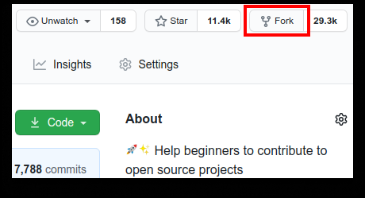
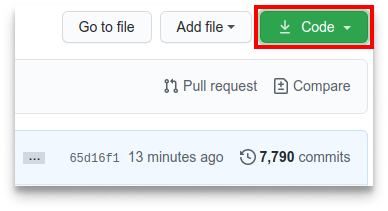
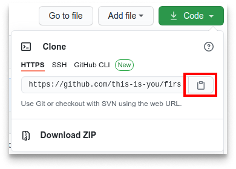

# Contributing

You can contribute to this project by following the _fork -> clone -> edit -> pull request_ workflow of GitHub.  
The steps of this workflow are explained in the [guidelines](#Guidelines) below.

The given examples show you how to use git in a terminal/shell, but similar steps can be taken by using your favorite
IDE.

## Guidelines

### Fork this repository



Fork this repository by clicking on the fork button on the top of this page.
This will create a copy of this repository in your account.

### Clone the repository




1. Go to your GitHub account and open the forked repository.
2. Click on the code button and then the _copy to clipboard_ icon.
3. Open a terminal and run the following git command:

```shell
git clone "repository URL"
```

Where `repository URL` is the URL to your repository (your fork of this project).
See step 2 above to obtain the url.
Example:

```shell
git clone git@github.com:github-username/mushroom-strategy.git
```

Where `github-username` is your GitHub username.  
Here you're copying the contents of the first-contributions repository on GitHub to your computer.

### Create a branch

Go to the repository directory on your computer and create a branch, using the `git switch` command:

```shell
git switch -c your-new-branch-name
```

### Make necessary changes and commit those changes

Make changes to existing files, add new files or remove obsolete files.
When you're done working on your changes, add those changes to the branch and commit them.

```shell
git add file-name
git commit -m "Enter you commit message here"
```

### Push changes to GitHub

Push your changes using the command `git push`:

```shell
git push -u origin your-branch-name
```

Where `your-branch-name` is the name of the branch you created earlier.

<details>
<summary><strong>If you get any errors while pushing, click here:</strong></summary>

- #### Authentication Error

<pre>
remote: Support for password authentication was removed on August 13, 2021. Please use a personal access token instead.
remote: Please see https://github.blog/2020-12-15-token-authentication-requirements-for-git-operations/ for more information.
fatal: Authentication failed for 'https://github.com/your-username/first-contributions.git/'
</pre>

Go
to [GitHub's tutorial](https://docs.github.com/en/authentication/connecting-to-github-with-ssh/adding-a-new-ssh-key-to-your-github-account)
on generating and configuring an SSH key to your account.
</details>

### Submit your changes for review

Go to your repository on GitHub where you'll see a `Compare & pull request` button. Click on that button.


#### Submit the pull request.


After a review, your changes will be merged into the main branch of this project.  
You will get a notification email once the changes have been merged.

## Agreements

1. We must NOT commit changes of directory `dist` or its content.
   The contents are created by our Continuous Integration workflow.
2. All files are properly formatted and don't contain obsolete code.
3. We follow the Commit Guidelines as described [here](https://github.com/DigiLive/gitChangelog/wiki/1-Introduction).

## Prevent changes to the distribution directory

As agreed above, we must not commit any changes of directory `dist` or its content.  
Therefore, you can configure your local git repository to ignore this directory.

```shell
git update-index --skip-worktree ./dist/
git update-index --skip-worktree ./dist/mushroom-strategy.js
```

If you don't want to ignore them anymore, run the following commands:

```shell
git update-index --no-skip-worktree ./dist/
git update-index --skip-worktree ./dist/mushroom-strategy.js
```

### Additional method

You can add the directory to the `exclude` file of the repository.  
However, the directory or its content will not be ignored once it's already tracked.
The syntax is the same as for the `.gitignore` file.

Example of file `<project-directory>/.git/info/exclude`:

```gitexclude
# git ls-files --others --exclude-from=.git/info/exclude
# Lines that start with '#' are comments.
# For a project mostly in C, the following would be a good set of
# exclude patterns (uncomment them if you want to use them):
# *.[oa]
# *~
/dist/
```

Note: If you already have unstaged changes, you must run the following git command after editing your ignore-patterns:

```shell
git update-index --assume-unchanged ./dist/
```

