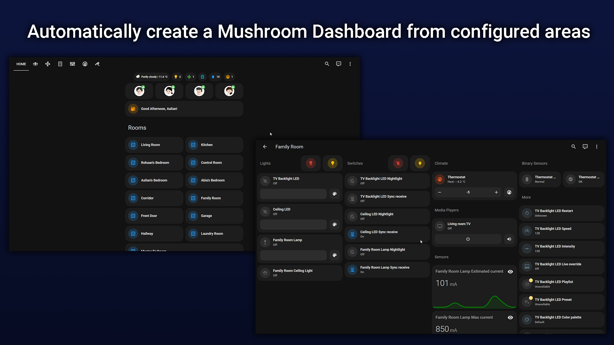
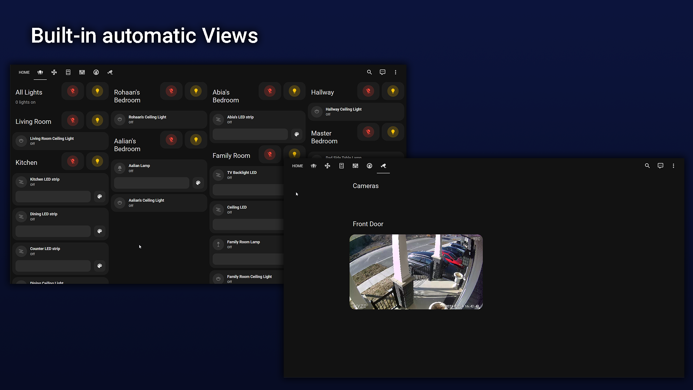
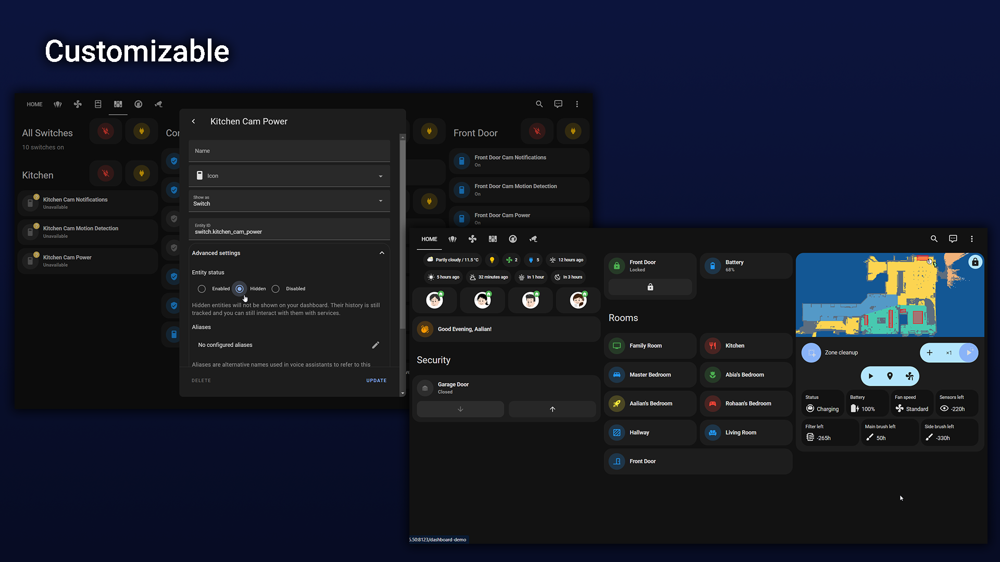
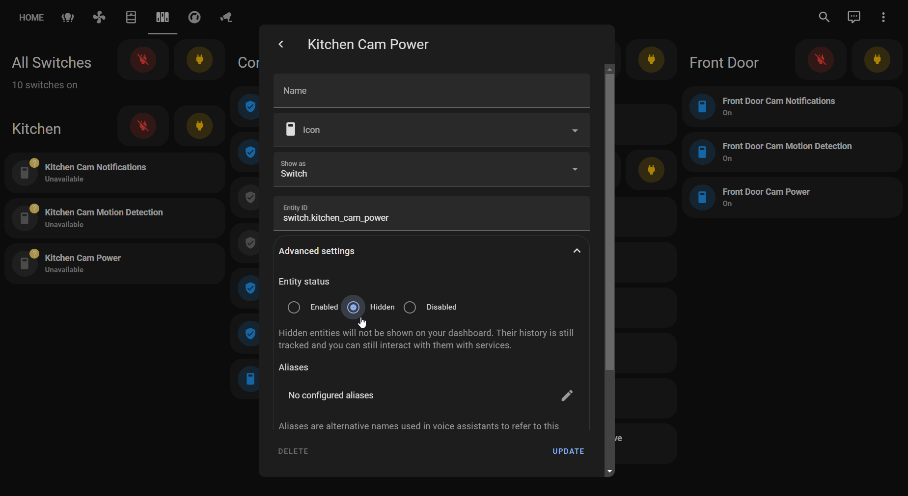
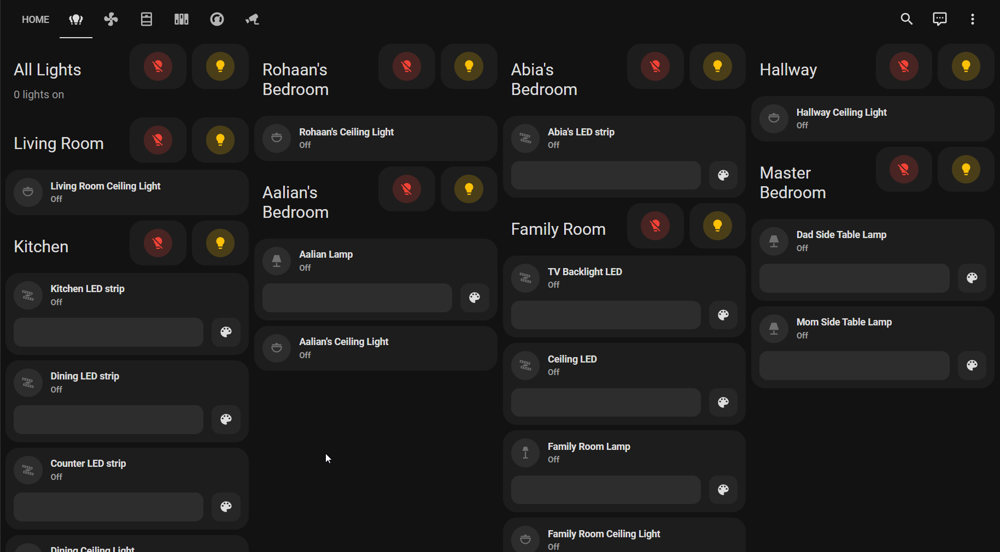
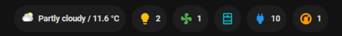

# Mushroom dashboard strategy

[![hacs][hacsBadge]][hacsUrl]
[![release][releaseBadge]][releaseUrl]








## What is Mushroom dashboard strategy?

Mushroom dashboard strategy provides a strategy for Home assistant to automatically create a dashboard using Mushroom
cards, the area configuration and entity configuration.

My goal is to propose a way to create powerful dashboards without the need of spending hours manually creating them.

**Note:** This is my first javascript code and GitHub repository. Any recommendations are always welcome.

### Features

- 🛠 Automatically create dashboard with three lines of yaml.
- 😍 Built-in Views for device-specific controls.
- 🎨 Many options to customize to fit your needs.

## Installation

### Prerequisites

You need to install these cards before using this strategy:

- [Mushroom cards][mushroomUrl]
- [Mini graph card][mini-graphUrl]

### HACS

Mushroom dashboard strategy is available in [HACS][hacsUrl] (Home Assistant Community Store).

1. Install HACS if you don't have it already.
2. Open HACS in Home Assistant.
3. Go to the "Frontend" section.
4. Click the button with the "+" icon
5. Search for "Mushroom dashboard" and install.

### Manual

1. Download `mushroom-strategy.js` file from
   the [`dist`](https://github.com/AalianKhan/mushroom-strategy/tree/main/dist) directory.
2. Put `mushroom-strategy.js` file into your `config/www` folder.
3. Add a reference to `mushroom-strategy.js` in Dashboard.
   There are two ways to do that:
    - **Using UI:** _Settings_ → _Dashboards_ → _More Options icon_ → _Resources_ → _Add Resource_ → Set _Url_
      as `/local/mushroom-strategy.js` → Set _Resource type_ as `JavaScript Module`.
      **Note:** If you do not see the Resources menu, you will need to enable _Advanced Mode_ in your _User Profile_
    - **Using YAML:** Add the following code to the `lovelace` section.
        ```yaml
        resources:
            - url: /local/mushroom-strategy.js
              type: module
        ```

## Usage

All the rounded cards can be configured using the Dashboard UI editor.

1. In the UI of the dashboard, click the three dots in the top right corner.
2. Click _Edit Dashboard_.
3. Click 3 dots again
4. Click `Raw configuration editor`
5. Add the following lines:

```yaml
strategy:
  type: custom:mushroom-strategy
views: []
```

### Hidding specific entities

When creating this dashboard for the first time, you probably have many entities that you don't want to see.

You can hide these entities by following the steps below:

1. Click and hold the entity
2. Click the `cog icon` in the top right corner of the popup.
3. Set `Visible` to `off`.

The view should update when the page is refreshed.

If you don't want to hide the entity from all dashboards, you can use [Card Options](#card-options) to hide specific
entities and devices.



### Adding devices to areas

You can add devices to an area by going to `Settings` found at the bottom of the sidebar.

1. Click `Devices and integration`
2. Select the integration of your device
3. Click the device you wish to add
4. Click the `pencil icon` found in the top right corner
5. Enter an area in area field.

You can also set an entity of that device to a different area by going to the advanced settings of that entity.

If you created an entity in your `configuration.yaml` you may need to enter a `unique_id` first before you set an area
to it.
See [docs](https://www.home-assistant.io/faq/unique_id/)

## Strategy options

You can set strategy options to further customize the dashboard.
By default, all views are enabled which include lights, fans, covers, switches, climates and cameras. All chips are also
enabled which count the number of devices on for the platforms light, fan, cover and climate. It also auto-selects a
weather entity for the weather chip.

The options available are:

| Name                 | Type                      | Default                                                 | Description                                                    |
|:---------------------|:--------------------------|:--------------------------------------------------------|:---------------------------------------------------------------|
| `areas`              | object (optional)         | unset                                                   | One or more areas in a list, see [areas object](#area-object). |
| `card_options`       | object (optional)         | unset                                                   | Card options for cards, see [Card Options](#card-options).     |
| `views`              | object (optional)         | All default views                                       | See available [Pre-built views](#pre-built-views).             |
| `chips`              | object                    | All count chips enabled with auto selected weather card | See [chips](#chips).                                           |
| `quick_access_cards` | array of cards (optional) | unset                                                   | List of cards to show between welcome card and rooms cards.    |
| `extra_cards`        | array of cards (optional  | unset                                                   | List of cards to show below room cards.                        |
| `extra_views`        | array of views (optional) | unset                                                   | List of views to add to the dashboard.                         |
| `domains`            | object (optional)         | All supported domains                                   | See [Supported domains](#supported-domains).                   |

#### Example

```yaml
strategy:
  type: custom:mushroom-strategy
  options:
    areas:
      family_room_id:
        name: Family Room
        icon: mdi:sofa
        icon_color: green
views: []
```

### Area Object

The area object includes all options from the template mushroom card and `extra_cards` which is a list of cards to show
at the top of the area subview.

| Name                  | Type              | Default        | Description                                                                                                                         |
|:----------------------|:------------------|:---------------|:------------------------------------------------------------------------------------------------------------------------------------|
| `name`                | string            | N.A.           | The name of the area.                                                                                                               |
| `icon`                | string (optional) | unset or empty | Icon to render. May contain [templates](https://www.home-assistant.io/docs/configuration/templating/).                              |
| `icon_color`          | string (optional) | unset or empty | Icon color to render. May contain [templates](https://www.home-assistant.io/docs/configuration/templating/).                        |
| `primary`             | string (optional) | unset or empty | Primary info to render. May contain [templates](https://www.home-assistant.io/docs/configuration/templating/).                      |
| `secondary`           | string (optional) | unset or empty | Secondary info to render. May contain [templates](https://www.home-assistant.io/docs/configuration/templating/).                    |
| `badge_icon`          | string (optional) | unset or empty | Badge icon to render. May contain [templates](https://www.home-assistant.io/docs/configuration/templating/).                        |
| `badge_color`         | string (optional) | unset or empty | Badge icon color to render. May contain [templates](https://www.home-assistant.io/docs/configuration/templating/).                  |
| `picture`             | string (optional) | unset or empty | Picture to render. May contain [templates](https://www.home-assistant.io/docs/configuration/templating/).                           |
| `multiline_secondary` | boolean           | `false`        | Enables support for multiline text for the secondary info.                                                                          |
| `layout`              | string (optional) | unset or empty | Layout of the card. Vertical, horizontal and default layout are supported.                                                          |
| `fill_container`      | boolean           | `false`        | Fill container or not. Useful when card is in a grid, vertical or horizontal layout.                                                |
| `tap_action`          | action*           | `none`         | Home assistant action to perform on tap.                                                                                            |
| `hold_action`         | action*           | `none`         | Home assistant action to perform on hold.                                                                                           |
| `entity_id`           | `string` `array`  | unset or empty | Only reacts to the state changes of these entities. This can be used if the automatic analysis fails to find all relevant entities. |
| `double_tap_action`   | action*           | `more-info`    | Home assistant action to perform on double_tap.                                                                                     |
| `hidden`              | boolean           | false          | Set to `true` to exclude the area from the dashboard and views.                                                                     |
| `order`               | number            | Infinity       | Ordering position of the area in the list of available areas.                                                                       |
| `extra_cards`         | array of cards    | unset or empty | A list of cards to show on the top of the area subview.                                                                             |
| `type`                | string            | `default`      | Set to a type of area card. (Currently supported: `default` & `HaAreaCard`                                                          |

*) `more-info` `toggle` `call-service` `navigate` `url` `none`

#### Example

```yaml
strategy:
  type: custom:mushroom-strategy
  options:
    areas:
      family_room_id:
        name: Family Room
        icon: mdi:television
        icon_color: green
        order: 1
        extra_cards:
          - type: custom:mushroom-chips-card
            chips:
              - type: entity
                entity: sensor.family_room_temperature
                icon: mdi:thermometer
                icon_color: pink
            alignment: center
      kitchen_id:
        name: Kitchen
        icon: mdi:silverware-fork-knife
        icon_color: red
        order: 2
      garage_id:
        hidden: true
      hallway_id:
        type: HaAreaCard
views: []
```

#### Undisclosed Area

The strategy has a special area, named `undisclosed`.
This area is enabled by default and includes the entities that aren't linked to any Home Assistant area.

The area can be configured like any other area as described above.
To exclude this area from the dashboard and views, set its property `hidden` to `true`.

#### Setting options for all areas

Use `_` as an identifier to set the options for all areas.

The following example sets the type of all area-cards to Home Assistant's area card:

```yaml
strategy:
  type: custom:mushroom-strategy
  options:
    areas:
      _:
        type: HaAreaCard
views: []
```

### Card Options

The `card_options` entry enables you to specify a card type for an entity or to hide the card from the dashboard.
You can also provide a device ID and hide all entities linked to that device.
See [Instructions on to find a device ID](https://community.home-assistant.io/t/device-id-entity-id-where-to-find/289230/4?u=aaliankhan).

#### Example

```yaml
strategy:
  type: custom:mushroom-strategy
  options:
    card_options:
      fan.master_bedroom_fan:
        type: custom:mushroom-fan-card
      remote.harmony_hub_wk:
        hidden: true
      077ba0492c9bb3b31ffac34f1f3a626a:
        hidden: true

views: []
```

### Pre-built views



Mushroom strategy includes pre-built views to control/view specific domains.
All devices that are in an area where `hidden` is set to false/undefined are shown*.

By default, all pre-built views below are shown:

| Available views | type    | Description                                                                  |
|:----------------|:--------|:-----------------------------------------------------------------------------|
| `light`         | object* | View to control all lights and lights of each area.                          |
| `fan`           | object* | View to control all fans and fans of each area.                              |
| `cover`         | object* | View to control all covers and covers of each area.                          |
| `switch`        | object* | View to control all switches and switches of each area.                      |
| `climate`       | object* | View to control climate devices such as thermostats. Seperated by each area. |
| `camera`        | object* | View to show all cameras using WebRTC cards. Seperated by each area.         |

* See [View Options](#view-options).

#### View Options

For each of the pre-built views, the following options are available:

| name     | type    | description                                                                                   |
|:---------|:--------|:----------------------------------------------------------------------------------------------|
| `title`  | string  | Title of the view in the navigation bar. (Shown when no icon is defined or hovering above it. |
| `icon`   | string  | Icon of the view in the navigation bar.                                                       |
| `order`  | string  | Ordering position of the view in the navigation bar.                                          |
| `hidden` | boolean | Set to `true` to exclude the view from the dashboard                                          |

#### Example

```yaml
strategy:
  type: custom:mushroom-strategy
  options:
    views:
      light:
        order: 0
        title: illumination
      switch:
        order: 1
        hidden: true
        icon: mdi:toggle-switch
views: []
```

### Supported domains

The following domains are supported and enabled by default:

* light
* fan
* cover
* switch
* camera
* lock
* climate
* media_player
* sensor
* binary_sensor
* default (Miscellaneous)

For these domains, the following options are supported:

| Option         | type    | Description                                                                |
|:---------------|:--------|:---------------------------------------------------------------------------|
| `title`        | string  | Title of the domain in a view.                                             |
| `showControls` | boolean | Weather to show controls int a view, to switch all entities of the domain. |
| `hidden`       | boolean | Set to `true` to exclude the view from the dashboard.                      |
| `order`        | number  | Ordering position of the domain entities in a view.                        |

#### Example

```YAML
strategy:
  type: custom:mushroom-strategy
  options:
    domains:
      lights:
        title: "My cool lights"
        order: 1
      switch:
        showControls: false
      default:
        hidden: true
views: []
```

### Chips



Mushroom strategy has chips that indicate the number of devices which are active for a specific domain.
All devices that are in an area where `hidden` is set to false/undefined are counted.
By default, all chips are enabled.

You can manually configure a weather entity-id to use, and there's also an option to add
more [Mushroom Chips][mushroom-chipsUrl] using `extra_chips`.

**Note: To hide the weather chip, you should hide or disable the entity itself.**

| Available chips  | type              | Description                                                                                                    |
|:-----------------|:------------------|:---------------------------------------------------------------------------------------------------------------|
| `light_count`    | boolean           | Chip to display the number of lights on, tapping turns off all lights, holding navigates to lights view.       |
| `fan_count`      | boolean           | Chip to display the number of fans on, tapping turns off all fans, holding navigates to fans view.             |
| `cover_count`    | boolean           | Chip to display the number of covers not closed, tapping navigates to covers view.                             |
| `switch_count`   | boolean           | Chip to display the number of switches on, tapping turns off all switches, holding navigates to switches view. |
| `climate_count`  | boolean           | Chip to display the number of climate not off, tapping navigates to climates view.                             |
| `weather_entity` | string (optional) | Entity ID for the weather chip to use, accepts `weather.` only.                                                |
| `extra_chips`    | array (optional)  | List of extra chips to display, see [Mushroom Chips][mushroom-chipsUrl].                                       |

#### Example

```yaml
strategy:
  type: custom:mushroom-strategy
  options:
    chips:
      climate_count: false
      cover_count: false
      weather_entity: weather.forecast_home
      extra_chips:
        - type: conditional
          conditions:
            - entity: lock.front_door
              state: unlocked
          chip:
            type: entity
            entity: lock.front_door
            icon_color: red
            content_info: none
            tap_action:
              action: toggle
```

## Full Example

```yaml
strategy:
  type: custom:mushroom-strategy
  options:
    views:
      light:
        title: illumination
      switches:
        hidden: true
        icon: mdi:toggle-switch
    chips:
      weather_entity: weather.forecast_home
      climate_count: false
      cover_count: false
      extra_chips:
        - type: conditional
          conditions:
            - entity: lock.front_door
              state: unlocked
          chip:
            type: entity
            entity: lock.front_door
            icon_color: red
            content_info: none
            icon: ''
            use_entity_picture: false
            tap_action:
              action: toggle
        - type: conditional
          conditions:
            - entity: cover.garage_door
              state_not: closed
          chip:
            type: entity
            entity: cover.garage_door
            icon_color: red
            content_info: none
            tap_action:
              action: toggle
    areas:
      family_room_id:
        name: Family Room
        icon: mdi:television
        icon_color: green
        extra_cards:
          - type: custom:mushroom-chips-card
            chips:
              - type: entity
                entity: sensor.family_room_temperature
                icon: mdi:thermometer
                icon_color: pink
            alignment: center
      kitchen_id:
        name: Kitchen
        icon: mdi:silverware-fork-knife
        icon_color: red
      master_bedroom_id:
        name: Master Bedroom
        icon: mdi:bed-king
        icon_color: blue
      abias_bedroom_id:
        name: Abia's Bedroom
        icon: mdi:flower-tulip
        icon_color: green
      aalians_bedroom_id:
        name: Aalian's Bedroom
        icon: mdi:rocket-launch
        icon_color: yellow
      rohaans_bedroom_id:
        name: Rohaan's Bedroom
        icon: mdi:controller
        icon_color: red
      hallway_id:
        name: Hallway
      living_room_id:
        name: Living Room
        icon: mdi:sofa
      front_door_id:
        name: Front Door
        icon: mdi:door-closed
    card_options:
      fan.master_bedroom_fan:
        type: custom:mushroom-fan-card
      remote.harmony_hub_wk:
        hidden: true
    quick_access_cards:
      - type: custom:mushroom-title-card
        title: Security
      - type: custom:mushroom-cover-card
        entity: cover.garage_door
        show_buttons_control: true
      - type: horizontal-stack
        cards:
          - type: custom:mushroom-lock-card
            entity: lock.front_door
          - type: custom:mushroom-entity-card
            entity: sensor.front_door_lock_battery
            name: Battery
    extra_cards:
      - type: custom:xiaomi-vacuum-map-card
        map_source:
          camera: camera.xiaomi_cloud_map_extractor
        calibration_source:
          camera: true
        entity: vacuum.robot_vacuum
        vacuum_platform: default
    extra_views:
      - theme: Backend-selected
        title: cool view
        path: cool-view
        icon: mdi:emoticon-cool
        badges: []
        cards:
          - type: markdown
            content: I am cool
views: []
```

## Credits

* The cards used are from [Mushroom][mushroomUrl], [Mini graph card][mini-graphUrl] and [WebRTC][webRtcUrl]
* Took inspiration from [Balloob battery strategy][balloobBatteryUrl]

## Contributors

* [DigiLive](https://github.com/DigiLive)

<!-- Badges References -->

[hacsBadge]: https://img.shields.io/badge/HACS-Default-41BDF5.svg

[releaseBadge]: https://img.shields.io/github/v/release/AalianKhan/mushroom-strategy?include_prereleases

<!-- Other References -->

[hacsUrl]: https://hacs.xyz

[releaseUrl]: https://github.com/AalianKhan/mushroom-strategy/releases

[mushroomUrl]: https://github.com/piitaya/lovelace-mushroom

[mushroom-chipsUrl]: https://github.com/piitaya/lovelace-mushroom/blob/main/docs/cards/chips.md

[mini-graphUrl]: https://github.com/kalkih/mini-graph-card

[webRtcUrl]: https://github.com/AlexxIT/WebRTC

[balloobBatteryUrl]: https://gist.github.com/balloob/4a70c83287ddba4e9085cb578ffb161f

